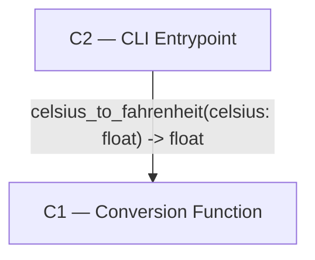

# Architecture

## Status

AGREED

## Overview

A single-file Python CLI: one pure function performs the Celsius-to-Fahrenheit
conversion, and one entrypoint function handles argument parsing, invocation,
and output. The two-function split is not an added layer — it is required
directly by the requirements' testability criterion (FR3), and nothing smaller
satisfies that criterion.

## Diagram

## Components

### C1 — Conversion Function

Responsibility: Compute Fahrenheit from Celsius via F = C * 9/5 + 32.
Location: `temp_convert.py`, function `celsius_to_fahrenheit`.
Depends on: None
Realises: FR2, FR3

### C2 — CLI Entrypoint

Responsibility: Parse the single command-line argument, call C1, print the
result, and exit non-zero with a stderr error message (no stack trace) on
invalid input.
Location: `temp_convert.py`, function `main`, guarded by
`if __name__ == "__main__":`.
Depends on: C1
Realises: FR1

## Interfaces

- **C2 → C1**: direct in-process function call,
  `celsius_to_fahrenheit(celsius: float) -> float`. No exceptions raised for
  valid float input; C1 never sees raw argv or performs I/O.

## Data

A single float value, passed as an argument and returned. No persistence,
no shared or in-memory state beyond the single call.

## Technology Choices

| Choice | Decision | Why | Rejected |
| --- | --- | --- | --- |
| Argument parsing | `argparse` with `type=float` on the celsius argument | Stdlib-only; on a non-numeric argument it already exits non-zero with a stderr usage/error message and no traceback, satisfying the error-handling acceptance criterion with no extra code | Manual `sys.argv` + `try/except float()`: reimplements what argparse already provides, for no benefit |
| Module layout | Single file, two functions | Two components as required by FR3, but no file-level split — a second file would be a layer the requirements don't ask for | Separate `convert.py` / `cli.py` files: adds import/packaging surface for a two-function tool |

## Requirement Coverage

| Functional requirement | Component(s) |
| --- | --- |
| Given a Celsius value as a command-line argument, print the equivalent Fahrenheit value | C2 |
| The conversion follows F = C * 9/5 + 32 | C1 |
| The conversion formula must be implemented as a standalone function that can be unit-tested directly, in isolation from command-line argument parsing and process I/O | C1 |

## Risks

None material. The tool has no persistence, concurrency, network, or external
dependency surface; the only interface is a single in-process function call.

## Open Architecture Questions

None

## Deviations

